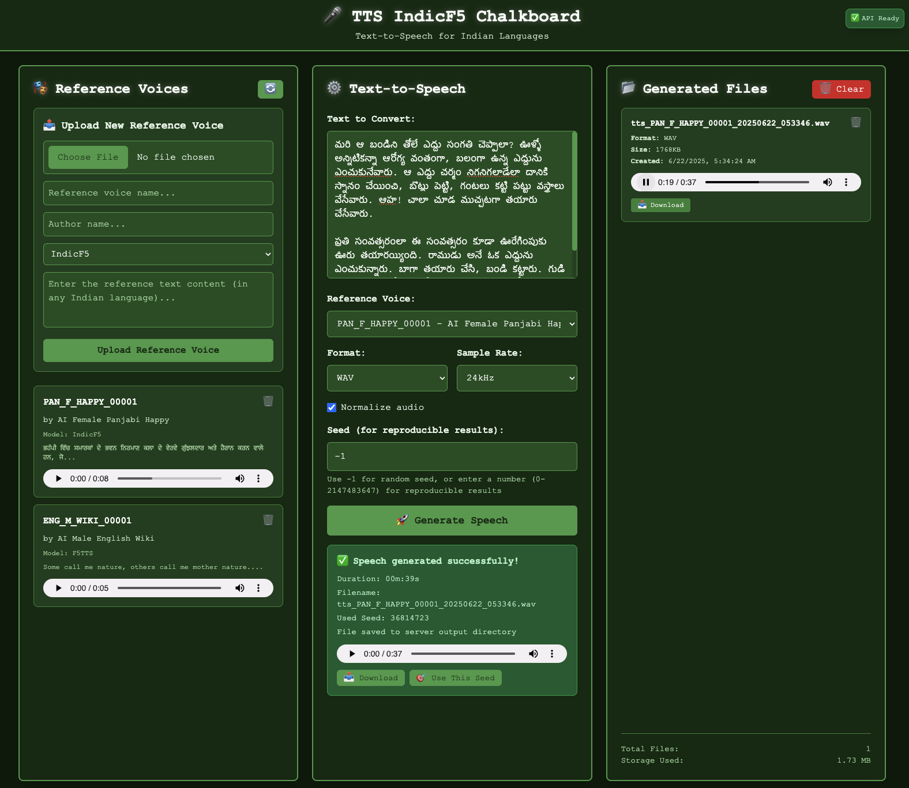
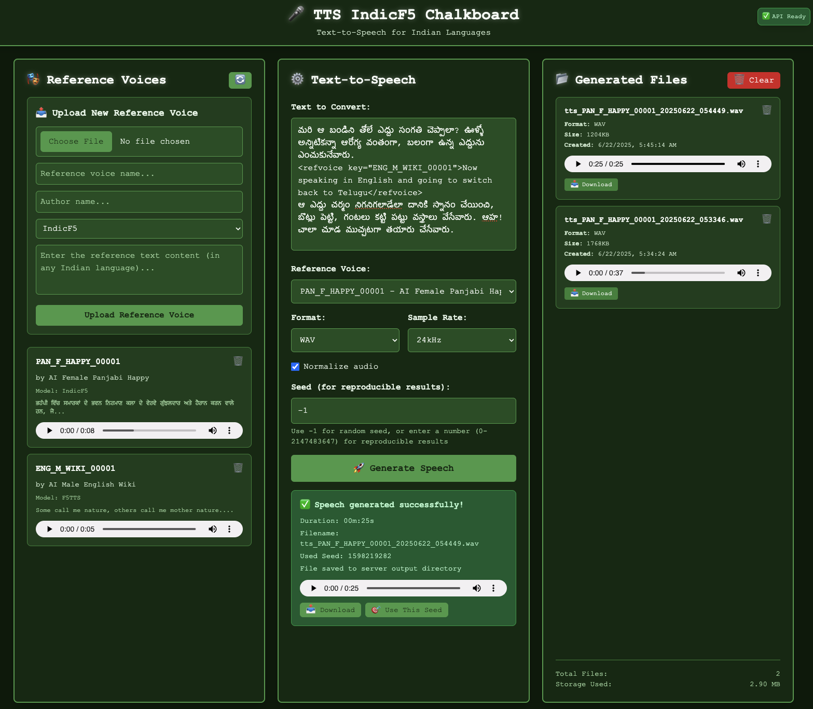

## 🚀 Harnessing AI for Text-to-Speech: Indic Languages and English Locally

### Why Local TTS Matters

- Text-to-Speech now sounds almost like real humans
- Open-source models run on your computer – no internet needed, no monthly costs, complete privacy
- Several Tools available for multiple languages and use cases:
  - [IndicF5](https://github.com/AI4Bharat/IndicF5) for Indian languages (Telugu, Tamil, Hindi, etc.)
  - [F5 TTS](https://github.com/SWivid/F5-TTS) for English (Foundation for IndicF5)
  - [Chatterbox](https://github.com/resemble-ai/chatterbox) for English (also called _ChatterTTS_)
- With GPU acceleration, these tools now work smoothly on personal computers

---

### IndicF5: Speaking Indian Languages

**IndicF5** created by [AI4Bharat](https://ai4bharat.iitm.ac.in/) (IIT Madras) is a speech model that supports 11 Indian languages. It was trained on 1,417 hours of speech data.

#### Key Features

- Works with **Assamese, Bengali, Gujarati, Hindi, Kannada, Malayalam, Marathi, Odia, Punjabi, Tamil, Telugu**
- Speech quality that sounds like real humans
- **Voice cloning** using voice samples
- High-quality 24 kHz audio output

#### Getting It Working

- At first, I had trouble setting it up despite the clear documentation. This was mostly due to my limited experience with Huggingface and TTS models.
- After several hours of research, I got it working on my system and even improved it to use the `MPS (Apple Silicon) GPU` on my Mac Studio, which made it much faster.
- To make it easier for others, I created a modified version of `IndicF5` that I can run with a single command, either directly on my computer or through Docker on self hosted server.
- All credit goes to the `AI4Bharat` team - I simply made it easier to install and use locally, which helps me with my large collection of Indian language texts.

##### Run It On Your Computer

```bash
# Download the code
git clone https://github.com/hareeshbabu82ns/TTSIndicF5.git

# Start it (for Mac with MPS support for PC uses Nvidia GPU or just runs on CPU)
./start_api.sh
```

- The script will check for `conda` or `venv` and create one if needed
- It installs all necessary software and starts the app at `https://localhost:8000/api_demo.html`
- The web interface was created with `Github Copilot`
- The app includes two AI reverence voices: `PAN_F_HAPPY_00001 - IndicF5` (for Indian languages) and `ENG_M_WIKI_00001 - F5TTS` (for English)
- Just type your text and click `Generate Speech`

<audio controls>
  <source src="01_tts_gen_telugu.wav" type="audio/wav">
  Your browser does not support the audio element.
</audio>
- For this 62-word Telugu sample, my Mac Studio (M4 Max 64 GB) took 39 seconds
- I added language switching to make it more useful. We can mix languages in one text, like this example that starts with Telugu, switches to English, and returns to Telugu:

```
మరి ఆ బండిని తోలే ఎద్దు సంగతి చెప్పాలా? ఊళ్ళో అన్నిటికన్నా ఆరోగ్య వంతంగా, బలంగా ఉన్న ఎద్దును ఎంచుకునేవారు.
<refvoice key="ENG_M_WIKI_00001">Now speaking in English and going to switch back to Telugu</refvoice>
ఆ ఎద్దు చర్మం నిగనిగలాడేలా దానికి స్నానం చేయించి, బొట్లు పెట్టి, గంటలు కట్టి పట్టు వస్త్రాలు వేసేవారు. ఆహ! చాలా చూడ ముచ్చటగా తయారు చేసేవారు.
```



<audio controls>
  <source src="02_tts_gen_tel_eng_switch.wav" type="audio/wav">
  Your browser does not support the audio element.
</audio>

##### Run Using Docker

```bash
# Build and run locally
docker compose -f docker-compose.yml --env-file .env up

# Or use the pre-built version (not production ready, just named prod)
docker compose -f docker-compose-prod.yml --env-file .env.prod up -d
```

- Sample `.env.prod` file:

```env
VERSION=0.0.4
PORT=8000
```

---

### What The API Can Do

App provides a simple API with FastAPI:

- `/tts` endpoint for text-to-speech functions:
  - Converts text to speech using your chosen voice
  - Breaks long text into smaller chunks (300 characters or full sentences)
  - Handles voice switching with `<refvoice key="">text</refvoice>` tags
- `/referenceVoices` lets you manage voice samples
- `/files` helps you view and play created audio files
- `/docs` shows all available API functions

The web interface lets you type text, pick voices, adjust settings, and listen to the results.

---

### What You Can Do With It

- Create **podcasts** in English or Indian languages
- Make **educational content** with AI narration of stories or news
- Improve **accessibility** with screen readers in regional languages
- Add **voice narration to games** in multiple languages

---

### Wrapping Up

Many thanks to AI4Bharat for creating these models and making them available, and to Huggingface for hosting so many AI models that are easy to find and use.

Open-source AI now lets us run high-quality voice models on our own computers. With IndicF5, I built a flexible system that works with both English and Indian languages—with no cloud services needed, full control, and expressive voices.

I believe in using AI to boost my productivity rather than becoming dependent on it. AI is a great tool, but relying too much on it for research can limit learning opportunities. The best part of learning comes from exploring on your own and discovering new things.

### Ethical Considerations

AI text-to-speech technology must be used responsibly and ethically. Users should only generate speech with their own voice samples or those they have explicit permission to use, rather than attempting to clone or imitate others' voices without consent. This is especially important as these local TTS models become more realistic and accessible to everyone.
